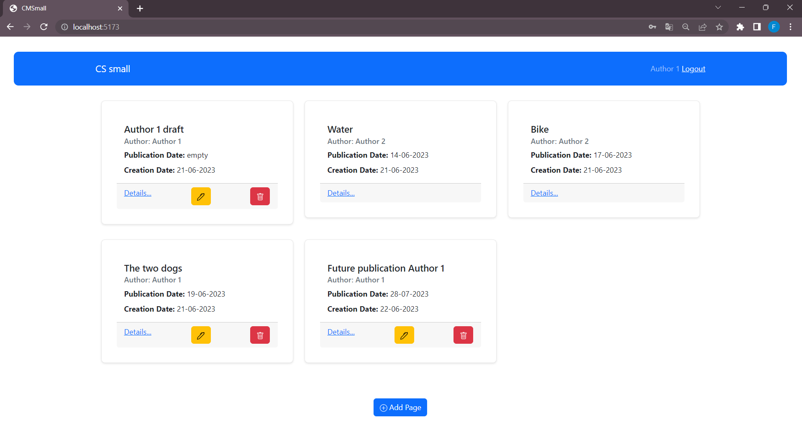
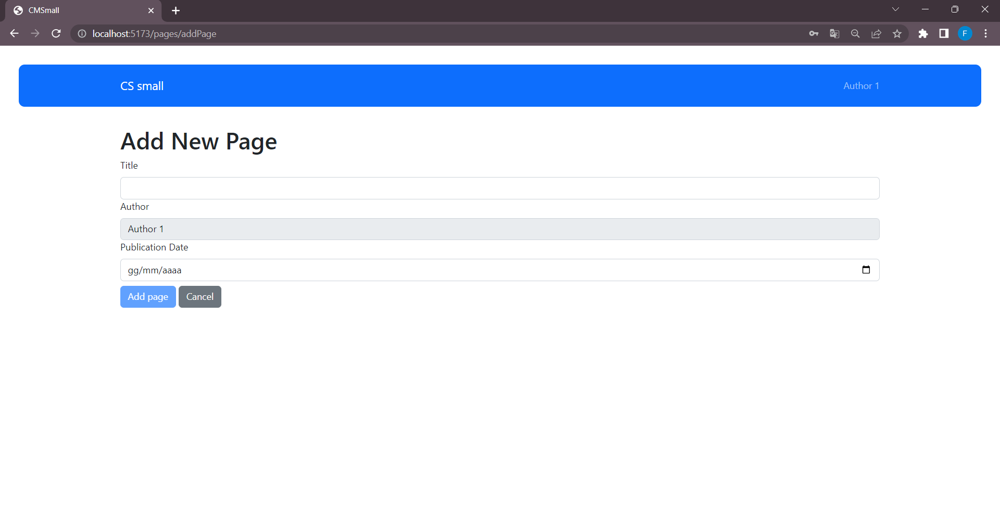

# Exam #309075: "CMSmall"

## Student: s309075 BUCCELLATO FEDERICO 

# Server side

## API Server

- POST `/api/login`
  - request
    - parameters: none
    - body content: json {username, password} of the user
  - response body content: json {id, name, email, role} about the authenticated user
- POST `/api/logout`
  - request
    - parameters: none
    - body content: none
  - response body content: none
- GET `/api/pages`
  - request
    - parameters: none
    - body content: none
  - response body content: json [{id, title, author, creationDate, publicationDate}], getting list of all pages
- GET `/api/pages/:pageId`
  - request
    - parameters: pageId, id of the page to take
    - body content: none
  - response body content: json {id, title, author, creationDate, publicationDate}
- GET `/api/pages/:pageId/blocks`
  - request
    - parameters: pageId, id of the page for taking blocks
    - body content: none
  - response body content: json [{id, type, pageId, orderBlock, content}], list of the contents in the specified page
- POST `/api/pages/:pageId/block`
  - request
    - parameters: pageId, id of the page in which the block is created
    - body content: json {type, content, orderBlock}
  - response body content: none
- POST `/api/pages`
  - request
    - parameters: none
    - body content: json {title, author, publicationDate}, page to add
  - response body content: json {lastId}, id of the created page
- PUT `/api/pages/:pageId`
  - request
    - parameters: pageId, id of the page to edit
    - body content: json {title, publicationDate, author}, 
  - response body content: none
- PUT `/api/block/:blockId`
  - request
    - parameters: blockId, id of the block to edit
    - body content: json { type, pageId, orderBlock, content }
  - response body content: none
- DELETE `/api/pages/:pageId`
  - request
    - parameters: pageId, id of the page to delete
    - body content: none
  - response body content: none
- DELETE `/api/blocks/:blockId`
  - request
    - parameters: blockId, id of the block to delete
    - body content: none
  - response body content: none
- GET `/api/webappname`
  - request
    - parameters: none
    - body content: none
  - response body content: json {name} with the name of the web app
- PUT `/api/webappname`
  - request
    - parameters: none
    - body content: json {name} with the new web app name
  - response body content: none

## Database Tables

- Table `users` - contains id, email, name, role, salt, password
- Table `pages` - contains id, title, author, creationDate, publicationDate
- Table `blocks` - contains id, type, pageId, orderBlock, content
- Table  `webappname` - contains id, name

# Client side

## React Client Application Routes

- Route `/`: Show the list of all pages and allow registered users or admin to modify their own pages
- Route `/pages/:idPage/blocks`: Show the list of contents of the specific page and allow registered users or admin to modify the blocks of their own page
- Route `/pages/:idPage/blocks/addBlock`: Allow registered users or admins to add or edit a new block in a page
- Route `/pages/addPage`: Allow registered users or admins to add or edit a page
- Route `/editWebAppName`: Allow admins to modify the name of the web app
- Route `/login`: Allow registered users to log in
- Any other routes: Page not found error

## Main React Components

- `MainLayout` (in `App.jsx`): Defines the main layout with the bar displaying the website name and login/logout actions
- `BlocksList` (in `BlocksList.jsx`): Shows all the contents of a singular page and allows authenticated users or admins to see buttons for deleting, adding, or modifying blocks
- `AddEditBlockForm` (in `AddEditBlockForm.jsx`): Displays the form where authenticated users or admins can enter information to create a new block or edit an existing block
- `PageList` (in `PageList.jsx`): Shows the list of all pages and allows registered users or admins to modify their own pages, as well as allowing authenticated users to delete, modify, or add a page
- `AddEditPageForm` (in `AddEditPageForm.jsx`): Displays the form where authenticated users or admins can enter information to create a new page or edit an existing page
- `EditWebAppNameForm` (in `EditWebAppNameForm.jsx`): Shows the form that allows admins to modify the name of the web app
- `Login` (in `Login.jsx`): Displays the form and allows registered users to log in
- `PageNotFound` (in `PageNotFound.jsx`): Displays a "Page not found" error message for different URLs

(only _main_ components, minor ones may be skipped)

# Usage info

## Example Screenshot

## Users Credentials

| User | Email | Password | Role |
|-----------|-----------|-----------|-----------|
| Author 1  | user1@gmail.com | password  | User  |
| Author 2  | user2@gmail.com | password  | User  |
| Author 3  | user3@gmail.com | password  | User  |
| Federico Buccellato  | admin@gmail.com | password  | Admin  |
